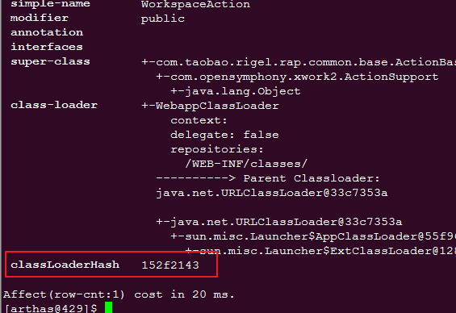
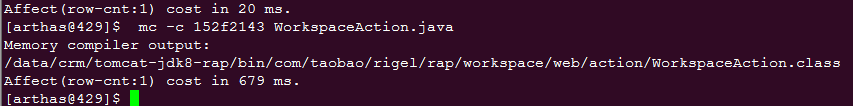
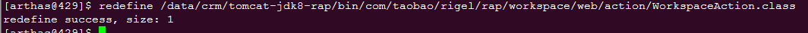

# 1. 安装启动arthas
去arthas官网下载一份压缩包

传到服务器上解压

```
/data/crm/arthas-arthas-all-3.2.0/bin/as.sh
```
或者直接下载个jar包

```
java -jar arthas-boot.jar
```
# 2. 查看目标类的加载器(以WorkspaceAction.java为例)
```
sc -d *WorkspaceAction | grep classLoaderHash 
```



记录编译器对象地址 152f2143

# 3. 反编译
(编译,修改后的文件加载时候有问题,后来在本地修改java文件,传上去加载的)
```
jad --source-only  com.taobao.rigel.rap.workspace.web.action.WorkspaceAction > /tmp/WorkspaceAction.java
```
# 4. 将修改后的java文件编译
```
mc -c 152f2143 WorkspaceAction.java
```
指定类加载,默认的执行路径是对应的程序的执行路径


# 5. 加载class文件

```
redefine /data/crm/tomcat-jdk8-rap/bin/com/taobao/rigel/rap/workspace/web/action/WorkspaceAction.class
```


